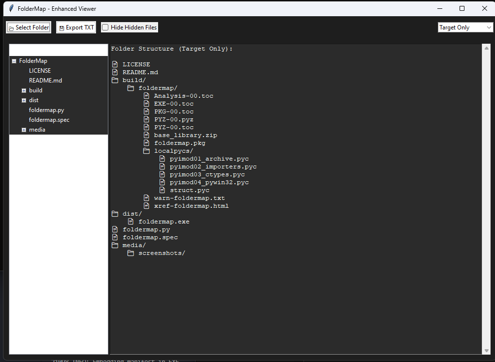

```markdown
# 📁 FolderPeek - Enhanced Folder Structure Viewer

A cross-platform GUI application for visualizing directory structures with advanced viewing modes and hidden file management.
```
 

## ✨ Features

- **Multiple View Modes**
  - 🎯 Target Only: Show contents of selected folder
  - ⬆️ With Preceding: Display path hierarchy from root
  - ⬇️ With Succeeding: Show subsequent folders in parent directory
- 👁️ Hidden File Management
  - Toggle visibility of hidden files/folders (.*)
  - Automatic mode adjustment when hiding files
- 💾 Export Capability
  - Save structure as TXT file with icons
- 🌗 Dual Panel Interface
  - Tree View (left) and Text View (right)
  - Modern dark theme with improved contrast

## 📥 Installation

1. **Prerequisites**
   - Python 3.6+
   - Tkinter (usually included with Python)

2. **Setup**
   ```bash
   git clone https://github.com/yourusername/folderpeek.git
   cd folderpeek
   ```

## 🚀 Usage

```bash
python folderpeek.py
```

### Interface Guide
1. **Select Folder**
   - Click "📂 Select Folder" to choose directory
   - Supported on Windows/macOS/Linux

2. **View Modes**
   - Use dropdown to switch between modes
   - *With Preceding* disabled when hiding files

3. **Hidden Files**
   - Check "Hide Hidden Files" to exclude .* items
   - Auto-refreshes current view

4. **Export**
   - Click "💾 Export TXT" to save structure
   - Choose destination path in dialog

## ⚠️ Important Notes

- Permission restrictions may limit some directory access
- Symbol meanings:
  - 📁 = Folder
  - 📄 = File
  - ⛔ = Permission denied
  - ❌ = Missing path component
- Folder names are case-sensitive on Linux/macOS

## 🤝 Contributing

Contributions welcome! Please:
1. Open an issue to discuss changes
2. Fork repository and create feature branch
3. Submit pull request with detailed description

## 📜 License

MIT License - See [LICENSE](LICENSE) file for details

---

**FolderPeek** © 2025 - Developed with ❤️ using Python & Tkinter  
Project maintained under active development


